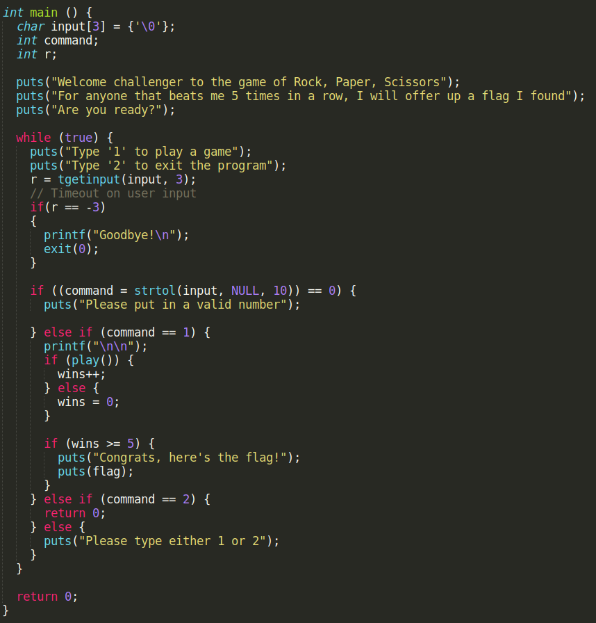
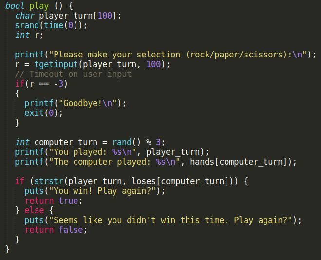
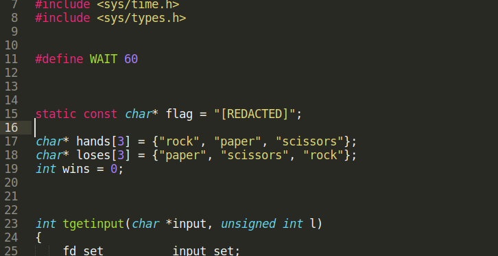
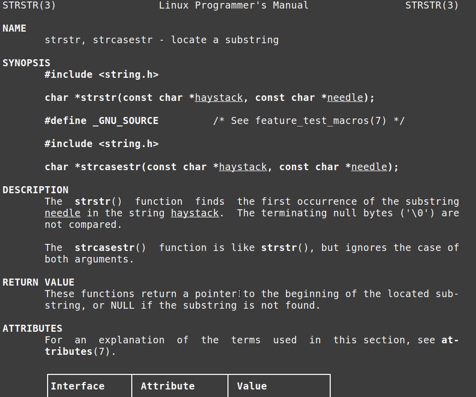
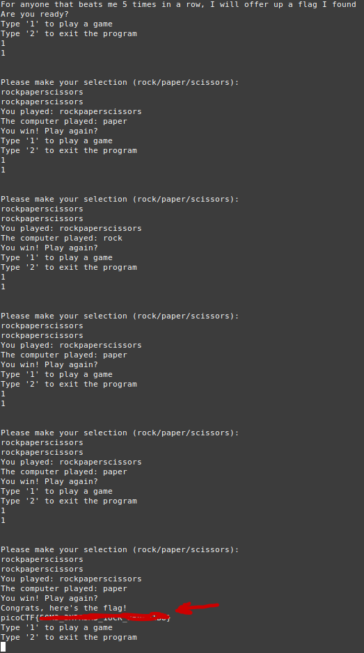

# PicoCTF2022 : RSP challenge writeup

Let's start by downloading the file from the link. We get the source code of the program with the flag redacted. The goal is to understand the program's logic and exploit it to get the flag.

 

The description tells us that the program plays rock, paper scissors against us. We start by taking a look at the `main()` function in the source code. The program prints a menu and then takes an input through the `tgetinput()` function. It calls the `play()` and if it returns *true* it increments the *win* counter, which is initialized to 0 at the beginning of the file. When the *win* counter becomes equal to 5, the flag gets printed on the screen. Now the goal is to analyze the `play()` function to understand how to get *True* as the returned value.

The function asks us to choose between rock, paper and scissors. It takes our input and puts it in the *player_turn* array that it defined at the beginning of the  function. It also uses two other arrays : *hands* and *loses*. They are both character pointers arrays. The first one contains the pointers to the strings "rock", "paper" and "scissors". The second contains the pointers to the same strings, but in a different order, so that every string in *hands* is allineated with the corresponding losing string in the *loses* array.

`play()` generates a random integer with the `rand()` function and it does a modulus 3 operation on it to make sure that the number is included between 0 and 2. That's because *computer_turn* will be used as an index in the *hands* and *loses* arrays. Then it prints the string we inserted as input and the string chosen by the computer, which is picked randomly from the *loses* array. Then the `strstr()` function is used. As usual, we can use the man page to see what it does.

This function *"... finds the first occurrence of the substring needle*(the first supplied string) *in the string haystack*(the second supplied string)*..."*. It then *"... returns a pointer to the located substring or NULL if the substring is not found"*. So what happens is that our choice and the computer choice (which is picked from the *loses* array using the *computer_turn* index) get printed onto the screen. Then the program takes a string from the *losing* array using the same random index. That is the string that beats the one the computer chose. If it's equal to our string, we won the match. So we need to supply a string which will always contain whatever string the computer chooses from the *loses* array. The string we want could be for example "rockpaperscissors". In this way, the function will always return a pointer and we'll always win the match, regardless of our opponent choice. If we do it 5 times in a row, we get the flag. Let's connect with netcat to try it.

It worked, we got the flag. 

